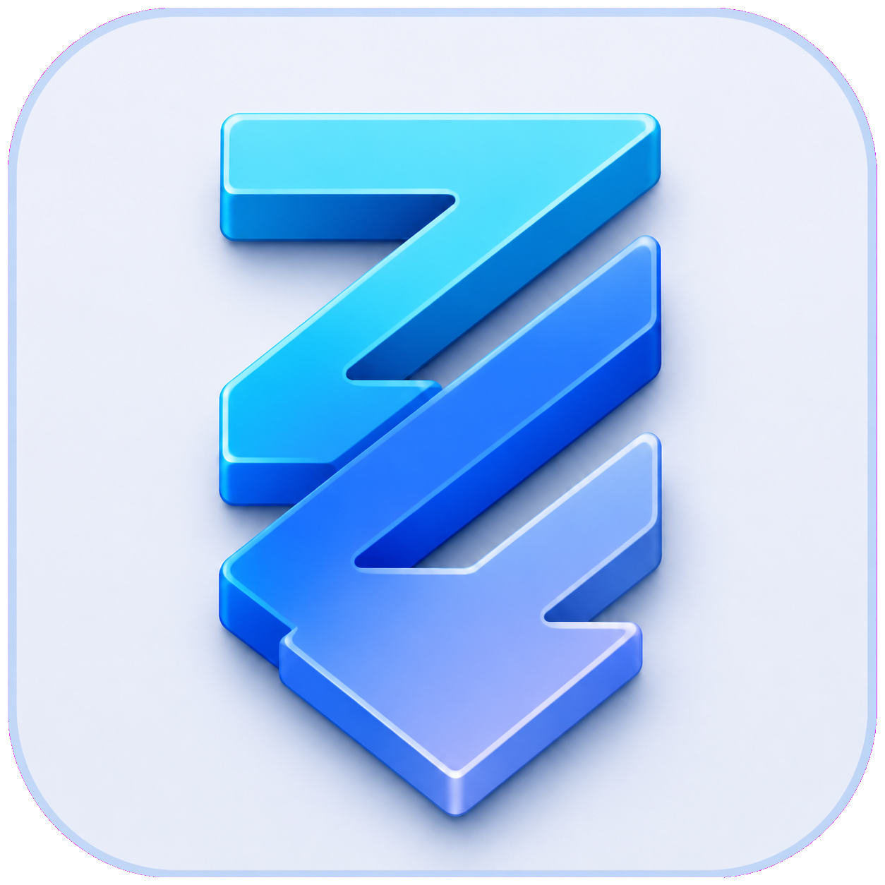

# ZZZDown



ZZZDown is a bilingual macOS and Windows desktop video downloader with a searchable local video library.

ZZZDown 是一款支持简体中文和英文的 macOS、Windows 桌面视频下载器，并附带可搜索、可分类的本地视频库。

## Features / 功能

- Video, playlist, collection, and creator-profile downloads / 单视频、播放列表、合集及创作者主页
- Bilibili, YouTube, Douyin, TikTok, Xinpianchang, and other yt-dlp-supported sites
- Up to 4K, resumable downloads, subtitles, metadata, and thumbnails / 最高 4K、断点续传、字幕、元数据及封面
- Chrome, Edge, Firefox, or no-login mode / 支持 Chrome、Edge、Firefox及无登录模式
- One-task re-download/quality-upgrade switch that safely ignores old archive entries / 可对当前任务忽略旧下载记录并重新下载、升级画质
- Search, nested virtual folders, duplicate cleanup, recycle bin, restore, and file reveal
- 搜索、多级虚拟分类、重复清理、回收站、还原及文件定位
- Import an existing ZZZDown-compatible library / 导入现有兼容视频库
- Independently update the yt-dlp engine / 独立更新下载解析组件

## Install / 安装

Download the installer for your platform from GitHub Releases:

- `ZZZDown-vX.Y.Z-macOS-Apple-Silicon.dmg`
- `ZZZDown-vX.Y.Z-macOS-Apple-Silicon-portable.zip`
- `ZZZDown-vX.Y.Z-Windows-x64-Setup.exe`
- `ZZZDown-vX.Y.Z-Windows-x64-portable.zip`

下载 GitHub Releases 中与电脑匹配的安装包即可。

macOS builds support Apple Silicon. Portable ZIP archives can be extracted and run without an installer.

macOS 版本支持 Apple Silicon；便携版 ZIP 解压后无需安装即可运行。

The public builds are not code-signed. On macOS, Control-click the app and choose **Open** the first time. On Windows, choose **More info → Run anyway** if SmartScreen appears.

公开安装包未进行付费代码签名。macOS 首次运行时请按住 Control 点击并选择“打开”；Windows 出现 SmartScreen 时请选择“更多信息 → 仍要运行”。

## Development / 开发

```bash
python3 -m venv .venv
source .venv/bin/activate  # Windows: .venv\Scripts\activate
python -m pip install -e .
python -m zzzdown
```

Build macOS:

```bash
chmod +x scripts/build_macos.sh
scripts/build_macos.sh
```

Build Windows from PowerShell with Inno Setup 6 installed:

```powershell
scripts\build_windows.ps1
```

## Data and privacy / 数据和隐私

Browser cookies are read locally by yt-dlp and are never uploaded by ZZZDown. Downloaded media, settings, classifications, and recycle-bin data remain on the user's computer.

浏览器 Cookie 仅由 yt-dlp 在本机读取，ZZZDown 不会上传 Cookie。视频、设置、分类和回收站数据均保存在用户电脑中。

## Responsible use / 使用责任

Only download content that you are authorized to save. You are responsible for complying with website terms, copyright rules, and applicable law.

请仅下载你有权保存的内容，并自行遵守网站条款、版权规则及当地法律。

## License

MIT
